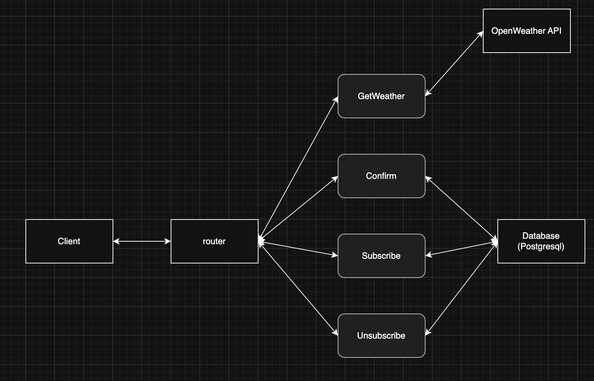

## Weather API General Logic

### API Scheme


### 1. Goals
- Let anyone request the current weather by city.
- Let users subscribe with their email, city.
- Require users to confirm their subscription with a unique token.
- Allow users to unsubscribe with the same token.

### 2. Main Parts
- **HTTP Layer**: accepts incoming web requests and returns JSON.
- **Application Layer**: runs the main logic (subscribe, confirm, unsubscribe, get weather).
- **Data Layer**: talks to PostgreSQL, runs migrations, and stores subscription records.
- **External API**: fetches real weather data from a OpenWeather API.

### 3. Data Flow
1. **Subscribe**  
   - API receives email, city, frequency.  
   - Logic creates a new subscription record with a token.  
   - Data layer saves it in the database.  
   - Returns the token in the response.

2. **Confirm**  
   - API receives a token.  
   - Logic finds the matching record and sets it as confirmed.  
   - Returns success or a 404 if not found.

3. **Unsubscribe**  
   - API receives a token.  
   - Logic deletes the matching record.  
   - Returns success or a 404 if not found.

4. **Get Weather**  
   - API receives a city name.  
   - Logic returns calls an external weather API.  
   - Returns temperature, humidity, and a description.

### 4. Reliability
- **Migrations on Startup**: the app applies database migrations automatically, so the schema is always up to date.
- **Health Checks**: the service waits for PostgreSQL to be ready before it starts.

### 5. Packaging & CI/CD
- **Docker + Docker Compose** for local development and easy setup.
- **GitHub Actions** pipeline:  
  1. Build Docker images.  
  2. Start the database and wait for it to be healthy.  
  3. Start the app service.  
  4. Run integration checks.  
  5. Tear down containers and clean up volumes.

## Getting Started

To run the application locally using Docker Compose (environment variables are configured in `docker-compose.yml`):

1. Clone the repository:

```bash
git clone https://github.com/RostislavKrotenko/weather-api.git
cd weather-api
```

2. Start the application with Docker Compose:

```bash
docker-compose up --build -d
```

This command will build the Go service, start the PostgreSQL database, and run the server on `http://localhost:8080`.

You can also try the live deployment here:
```
https://weather-api-jibz.onrender.com/
```
It may take a minute or two after you first hit the URL for the Docker container to finish building and the database migrations.

## Endpoints and Example cURL Requests for Each Status Code

### GET /api/weather

Retrieve current weather for a specified city.

**200 OK** – Successful response:

```bash
curl -i -X GET "http://localhost:8080/api/weather?city=Kyiv" \
     -H "Accept: application/json"
```

**400 Bad Request** – Missing `city` parameter:

```bash
curl -i -X GET "http://localhost:8080/api/weather" \
     -H "Accept: application/json"
```

**404 Not Found** – City not found:

```bash
curl -i -X GET "http://localhost:8080/api/weather?city=NonexistentCity" \
     -H "Accept: application/json"
```

### POST /api/subscribe

Subscribe to weather updates for a city.

**200 OK** – Subscription successful:

```bash
curl -i -X POST "http://localhost:8080/api/subscribe" \
     -H "Content-Type: application/json" \
     -d '{"email":"you@example.com","city":"Kyiv","frequency":"daily"}'
```

**400 Bad Request** – Invalid input (missing fields or incorrect `frequency`):

```bash
curl -i -X POST "http://localhost:8080/api/subscribe" \
     -H "Content-Type: application/json" \
     -d '{}'
```

**409 Conflict** – Email already subscribed:

```bash
# After a successful subscription, repeat the same request:

curl -i -X POST "http://localhost:8080/api/subscribe" \
     -H "Content-Type: application/json" \
     -d '{"email":"you@example.com","city":"Kyiv","frequency":"daily"}'
```

---

### GET /api/confirm/{token}

Confirm a subscription using the provided token.

**200 OK** – Subscription confirmed:

```bash
curl -i -X GET "http://localhost:8080/api/confirm/123e4567-e89b-12d3-a456-426655440000" \
     -H "Accept: application/json"
```

**400 Bad Request** – Invalid (empty or malformed) token:

```bash
curl -i -X GET "http://localhost:8080/api/confirm/invalid-token" \
     -H "Accept: application/json"
```

**404 Not Found** – Token not found in the database:

```bash
curl -i -X GET "http://localhost:8080/api/confirm/00000000-0000-0000-0000-000000000000" \
     -H "Accept: application/json"
```

### GET /api/unsubscribe/{token}

Unsubscribe from weather updates using the provided token.

**200 OK** – Unsubscription successful:

```bash
curl -i -X GET "http://localhost:8080/api/unsubscribe/123e4567-e89b-12d3-a456-426655440000" \
     -H "Accept: application/json"
```

**400 Bad Request** – Invalid (empty or malformed) token:

```bash
curl -i -X GET "http://localhost:8080/api/unsubscribe/invalid-token" \
     -H "Accept: application/json"
```

**404 Not Found** – Token not found in the database:

```bash
curl -i -X GET "http://localhost:8080/api/unsubscribe/00000000-0000-0000-0000-000000000000" \
     -H "Accept: application/json"
```